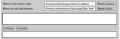
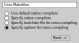
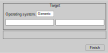
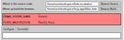

4diac FORTE for Posix PikeOS 5.x
==========================

This instruction assumes you have a Linux system with a PikeOS 5.x installation and a CODOE installation matching to the installed PikeOS Version.  
(CODEO is the Eclipse-based IDE for developing PikeOS projects shipped with the PikeOS product.)
Also CMAKE and CMAKE-GUI are installed.

Assumming you are familar with PikeOS basics explained in the "pikeos-tutorial.pdf".

Assuming you have a CODEO workspace with 4 projects:

 * **/home/user/workspace**  
   CODEO workspace
   *  **🗁 pool**  
    "CUSTOM POOL" for all PikeOS Projects
   *  **🗁 forte-incubation**  
    4diac FORTE source code  
        Imported project using CODEOs (Eclipse) import wizard  (`File → Import → General → Projects from Folder or Archive`).
        After importing the project was renamed to "forte-incubation".  
        The import source may be a cloned git repository
        (`git://git.eclipse.org/gitroot/4diac/org.eclipse.4diac.forte.git`) or the
        ZIP-File "4diac FORTE Source" downloaded from [eclipse.org/4diac](https://eclipse.dev/4diac/en_dow.php).
    * **🗁 lwip.app**  
    PikeOS 5.x Application Project of type *Posix Project / lwip-build*.
    * **🗁 forteserver.int**  
    PikeOS 5.x Integration Project of type *Integration Project / devel-posix*.

    
Patching "lwip.app"
-------------------
The `lwip.app` application project will build a library (`iblwip.a`) that is required by 4diac FORTE.
So we will *abuse* this project to build 4diac FORTE (binary name: `forte`) together with `iblwip.a`.  
Apply patch `forte-incubation/src/arch/pikeos_posix/lwip.patch` to the `lwip.app`.  
This will adapt the Makefile and the `lwip.app/lwipopts.h` file as required for building 4diac FORTE. Patching  `lwip.app/lwipopts.h` enables multicast which 4diac FORTE uses when multiple instances are communicating with each other.
In addition, a folder `lwip.app/4diac-forte`. This folder will be used by the `forte-incubation` project to store the required source and Make-files into for building the `forte` binary.

Running CMAKE for "forte-incubation"
------------------------------------
The "PikeOS Posix" target of the `forte-incubation` project needs the environment variables exported by `lwip.app/PikeOS.sh`.

Open a shell
(e.g. on selecting `lwip.app` in CODEO and pushing <kbd>⇧</kbd>+<kbd>Alt</kbd>+<kbd>W</kbd> and selecting *Terminal*)
and execute:

```console
source /home/user/workspace/lwip.app/PikeOS.sh
cd ../forte-incubation
cmake-gui
```

*Alternatively, you can right-click on "forte-incubation" project and select "Properties".*  
*Select "C/C++-Build" and click on "Manage Configurations...".*
*Rename "RELEASE" to "CMAKE", remove all other existing configurations and press the "OK" button.*  
*Uncheck "Use default build command" and set it to:*  
&nbsp;&nbsp;&nbsp;&nbsp;&nbsp;&nbsp;*bash -c "source ${workspace_loc:/lwip.app/PikeOS.sh};cd ${workspace_loc:/forte-incubation};cmake-gui"*  
*Uncheck "Generate Makefiles automatically" and set "Build directory" to:*  
&nbsp;&nbsp;&nbsp;&nbsp;&nbsp;&nbsp;*${workspace_loc:/forte-incubation}/*  
*Now you can run CMAKE-GUI by right-click on "forte-incubation" project and selecting "Build Project".*

CMAKE-GUI shows a dialog. First set `forte-incubation` as source folder and `lwip.app` binary folder:

> 

Push <kbd>Configure</kbd> and select "Unix Makefiles" and "Specify options for cross-compiling":

> 

Push <kbd>Next</kbd>, set "Operating System" to "Generic" and leave all other fields blank.

> 

After that press <kbd>Finish</kbd> which will occur an expected error dialog. Close the dialog and set parameter "FORTE_ARCHITECTURE" to "PikeOS_Posix".
> 

Push <kbd>Configure</kbd> twice. Now no error should be present any more. This means that no parameter is highlighted with light-red color any more.


Building "forte" binary for PikeOS
----------------------------------
In the `lwip.app` project Make-target "all" will build `lwip.a` together with the `forte` binary.
Make-target "install" additionally will copy `forte` to `$PIKEOS_CUSTOM_POOL_DIR/posix`.


PikeOS Integration Project "forteserver.int"
--------------------------------------------
Select `posix-devel/Application/Posix Process` and change `Host file` to `CUSTOM_POOL/posix/forte`.
Now click the <kbd>Add...</kbd> button (under the *Project Structure* heading), add template `posix / lwIP Ethernet interface` to `Posix Process` and configure it:

| Key | Value | Example for QEMU with Usermode NW | Example for QEMU with TUN/TAP NW |
|:----|:------|:---------------------------------:|:--------------------------------:|
|Interface Address | e.g. MUXA Target IP +1 | 10.0.2.16 | 192.168.0.3                |
|Netmask | 255.x.x.x | 255.255.255.0              | 255.255.255.0                    |
|Gateway address | Gateway in target NW to reach the host | 10.0.2.2 | 192.168.0.1    |

The Project looks like this:

 * posix-devel
    * ▢ Application
      * ◘ POSIX Partition
      * ◙ POSIX Process
        * ... lwIP Ethernet ...
    * ▢ Default
    * ▢ Development Tools
    * ▢ qemu-...

Assuming we use QEMU with user mode network. This will let 4diac FORTE run on `10.0.2.16:61499` as `61499` is 4DIAC FORTE's default port.

> *NOTE: If you want to use a different port you have to add template* `posix / Environment variables` *to* `Posix Process` *(similar behavior like adding* `posix / lwIP Ethernet interface`*).*  
        *Parameter* `-c IP:PORT` *will start 4diac FORTE on an other port.*

Right-click on `POSIX Partition` and click "copy". Right-click on `Application` and click on `insert`. Rename "partition name" and "partition id" eg. to "posix2" and "3" as they have to be unique.  
Repeat this procedure for `POSIX Process`. Click on `POSIX Partition (2)` and assign process `POSIX Process (2)`. Click on `POSIX Process (2) / ... lwIP Ethernet ...` and change "DEPEND: LW_IP_DEVICE_IF" to "...-vchan2".  
Configure `POSIX Process (2) / ... lwIP Ethernet ...`:

| Key | Value | Example for QEMU with Usermode NW | Example for QEMU with TUN/TAP NW |
|:----|:------|:---------------------------------:|:--------------------------------:|
|Interface Address | e.g. "POSIX Process" +1 | 10.0.2.17 | 192.168.0.4               |
|Netmask | 255.x.x.x | 255.255.255.0              | 255.255.255.0                    |
|Gateway address | Gateway in target NW to reach the host | 10.0.2.2 | 192.168.0.1    |

Now the project looks like this:

 * posix-devel
    * ▢ Application
      * ◘ POSIX Partition
      * ◙ POSIX Process
      * ◘ POSIX Partition (2)
      * ◙ POSIX Process (2)
    * ▢ Default
    * ▢ Development Tools
      * ◙ muxa
         * channels
    * ▢ qemu-...
        * ▢ Monitor Kernel Drivers
        * ▢ ... Serial User Level Driver
        * ▢ ... Ethernet User Level Driver
            * ▢ ...-net-device
            * ▢ ...-net-vchan0
            * ▢ ...-net-vchan1
            * ▢ ...-net-vchan2
            * ▢ ...-net-vchan3

Open `Development Tools / muxa / channels` and delete the assignment of "POSIX Process (2)". Rename channel 4 to e.g. "posix2-stdio".  
Assign "POSIX Process (2)" to this channel.

Go to `qemu-... / ... Ethernet User Level Driver` and set "Enable Multicast Communication" to true for `...-net-device`,  `...-net-vchan0` and `...-net-vchan1`.

Now you are able to test the partitions by starting QEMU and perform the [4DIAC-step-by-step tutorial](https://eclipse.dev/4diac/en_help.php?helppage=html/4diacIDE/overview.html).

On using user mode network you have to start QEMU by selecting "Start QEMU with custom commandline" and defining portforwarding:

```
-net user,hostfwd=udp::21500-:1500,hostfwd=tcp:127.0.0.1:61499-10.0.2.16:61499,hostfwd=tcp:127.0.0.1:61500-10.0.2.17:61499,host=10.0.2.2,net=10.0.2.0/255.255.255.0
```

"Start QEMU with custom commandline" does not overwrite "muxa.xml"s Target IP and port as it would be by selecting "Start QEMU with user mode network".
This Make-target stub allows to adapt the generated "muxa.xml" to user mode networking:

```make
boot: all
	$(eval HOSTIP := 127.0.0.1)
	$(eval TARGETPORT := 21500)
	@sed -ie "s/^.*TargetIP.*$$/    <Parameter Name=\"TargetIP\" Value=\"$(HOSTIP)\"\/>/" muxa.xml
	@sed -ie "s/^.*HostIP.*$$/    <Parameter Name=\"HostIP\" Value=\"$(HOSTIP)\"\/>/" muxa.xml
	@sed -ie "s/^.*TargetPort.*$$/    <Parameter Name=\"TargetPort\" Value=\"$(TARGETPORT)\"\/>/" muxa.xml
```
